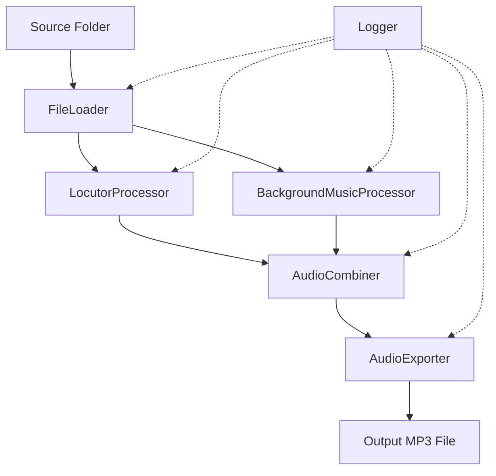

# Design Document: Audio Gran Campaña

## Overview

El sistema Audio Gran Campaña es un procesador de audio automatizado construido en Python que utiliza la biblioteca pydub para manipulación de audio. El sistema implementa un pipeline de procesamiento que:

1. Lee archivos de audio de locutor y fondos musicales desde una carpeta de origen
2. Unifica múltiples archivos de locutor en un orden específico
3. Procesa dos fondos musicales con efectos de volumen y transiciones
4. Combina el locutor unificado con el fondo musical unificado
5. Exporta el resultado final en formato MP3 de alta calidad

El diseño sigue un patrón de pipeline secuencial donde cada etapa produce un artefacto intermedio que se utiliza en la siguiente etapa. La arquitectura prioriza la claridad del flujo de procesamiento y la facilidad de debugging mediante logging detallado.

## Architecture

### High-Level Architecture

El sistema sigue una arquitectura de pipeline lineal con las siguientes etapas:

```
[Source Files] → [Loader] → [Locutor Processor] → [Background Music Processor] → [Combiner] → [Exporter] → [Output File]
```

### Component Diagram



### Technology Stack

- **Python 3.8+**: Lenguaje de programación principal
- **pydub**: Biblioteca para manipulación de audio (soporta WAV, MP3, efectos de volumen, crossfade, overlay)
- **ffmpeg**: Backend requerido por pydub para procesamiento de audio
- **pathlib**: Manejo de rutas de archivos
- **logging**: Sistema de logging para debugging y monitoreo

### Design Decisions

1. **pydub como biblioteca principal**: Elegida por su API simple y soporte completo para las operaciones requeridas (fade, crossfade, overlay)
2. **Pipeline secuencial**: Facilita el debugging y permite inspeccionar artefactos intermedios
3. **Logging extensivo**: Cada etapa registra su progreso para facilitar troubleshooting
4. **Validación de duraciones**: Se implementa validación explícita para detectar problemas de sincronización temprano

## Components and Interfaces

### 1. FileLoader

**Responsabilidad**: Cargar archivos de audio desde el sistema de archivos.

**Interface**:
```python
class FileLoader:
    def __init__(self, source_folder: Path):
        """Inicializa el loader con la carpeta de origen."""
        
    def load_audio(self, filename: str) -> Optional[AudioSegment]:
        """
        Carga un archivo de audio desde la carpeta de origen.
        Retorna None si el archivo no existe.
        Soporta formatos WAV y MP3.
        """
        
    def load_multiple(self, filenames: List[str]) -> Dict[str, Optional[AudioSegment]]:
        """
        Carga múltiples archivos de audio.
        Retorna un diccionario con filename como key y AudioSegment o None como value.
        """
```

**Dependencies**: pathlib, pydub.AudioSegment, logging

### 2. LocutorProcessor

**Responsabilidad**: Procesar y unificar archivos de audio de locutor.

**Interface**:
```python
class LocutorProcessor:
    LOCUTOR_SEQUENCE = [
        'Gran Campaña - Introduccion.wav',
        'Gran Campaña - Hora y lugar del evento.mp3',
        'Gran Campaña - Cuerpo.wav',
        'Gran Campaña - Hora y lugar del evento.mp3',
        'Gran Campaña - Cierre.wav'
    ]
    
    def __init__(self, file_loader: FileLoader):
        """Inicializa el processor con un FileLoader."""
        
    def unify_locutor_audio(self) -> LocutorResult:
        """
        Unifica los archivos de locutor en el orden especificado.
        Retorna un LocutorResult con el audio unificado y metadata.
        """
```

**Dependencies**: FileLoader, pydub.AudioSegment, logging

### 3. BackgroundMusicProcessor

**Responsabilidad**: Procesar fondos musicales con efectos de volumen y transiciones.

**Interface**:
```python
class BackgroundMusicProcessor:
    FIRST_BACKGROUND = 'Yo tengo un amigo que me ama.mp3'
    SECOND_BACKGROUND = 'Eres todo poderoso.mp3'
    CROSSFADE_DURATION = 3000  # milliseconds
    
    def __init__(self, file_loader: FileLoader):
        """Inicializa el processor con un FileLoader."""
        
    def process_first_background(self) -> AudioSegment:
        """
        Procesa el primer fondo musical:
        - 100% volumen primeros 5 segundos
        - Fade de 100% a 25% entre segundo 4 y 5
        - 25% volumen el resto
        """
        
    def calculate_second_background_duration(
        self, 
        locutor_duration_ms: int, 
        first_bg_duration_ms: int
    ) -> int:
        """
        Calcula la duración requerida del segundo fondo musical.
        Formula: locutor_duration + 10s - first_bg_duration + 3s
        """
        
    def process_second_background(self, required_duration_ms: int) -> AudioSegment:
        """
        Procesa el segundo fondo musical:
        - Recorta a la duración calculada
        - 20% volumen excepto últimos 5 segundos
        - Fade de 20% a 100% en últimos 5 segundos
        """
        
    def unify_backgrounds(
        self, 
        first_bg: AudioSegment, 
        second_bg: AudioSegment
    ) -> BackgroundResult:
        """
        Unifica ambos fondos musicales con crossfade de 3 segundos.
        Retorna un BackgroundResult con el audio unificado y metadata.
        """
```

**Dependencies**: FileLoader, pydub.AudioSegment, pydub.effects, logging

### 4. AudioCombiner

**Responsabilidad**: Combinar el locutor unificado con el fondo musical unificado.

**Interface**:
```python
class AudioCombiner:
    LOCUTOR_START_OFFSET = 5000  # milliseconds
    
    def __init__(self):
        """Inicializa el combiner."""
        
    def combine(
        self, 
        locutor: AudioSegment, 
        background: AudioSegment
    ) -> AudioSegment:
        """
        Combina el locutor con el fondo musical:
        - Locutor inicia a los 5 segundos
        - Locutor mantiene 100% volumen
        - Fondo musical hace fade a 100% cuando termina el locutor
        """
        
    def validate_durations(
        self, 
        locutor_duration_ms: int, 
        background_duration_ms: int,
        final_duration_ms: int
    ) -> bool:
        """
        Valida que las duraciones sean correctas:
        - Background debe ser locutor + 10s
        - Locutor debe terminar al menos 5s antes del final
        """
```

**Dependencies**: pydub.AudioSegment, logging

### 5. AudioExporter

**Responsabilidad**: Exportar el audio final a formato MP3.

**Interface**:
```python
class AudioExporter:
    MIN_BITRATE = "192k"
    
    def __init__(self, output_folder: Path):
        """Inicializa el exporter con la carpeta de salida."""
        
    def export(
        self, 
        audio: AudioSegment, 
        filename: str
    ) -> Path:
        """
        Exporta el audio a formato MP3 con bitrate mínimo de 192 kbps.
        Retorna la ruta del archivo exportado.
        """
```

**Dependencies**: pathlib, pydub.AudioSegment, logging

### 6. AudioProcessor (Main Orchestrator)

**Responsabilidad**: Orquestar el pipeline completo de procesamiento.

**Interface**:
```python
class AudioProcessor:
    def __init__(
        self, 
        source_folder: Path, 
        output_folder: Path
    ):
        """Inicializa el processor con carpetas de origen y destino."""
        
    def process(self) -> ProcessingResult:
        """
        Ejecuta el pipeline completo de procesamiento.
        Retorna un ProcessingResult con el resultado y metadata.
        """
```

**Dependencies**: Todos los componentes anteriores, logging

## Data Models

### AudioSegment (from pydub)

Representa un segmento de audio en memoria. Proporciona métodos para manipulación de audio.

**Propiedades clave**:
- `duration_seconds`: Duración en segundos
- `frame_rate`: Tasa de muestreo
- `channels`: Número de canales (mono/stereo)
- `sample_width`: Ancho de muestra en bytes

### LocutorResult

```python
@dataclass
class LocutorResult:
    audio: AudioSegment
    duration_ms: int
    files_loaded: List[str]
    files_skipped: List[str]
```

**Descripción**: Resultado del procesamiento de archivos de locutor.

### BackgroundResult

```python
@dataclass
class BackgroundResult:
    audio: AudioSegment
    duration_ms: int
    first_bg_duration_ms: int
    second_bg_duration_ms: int
    crossfade_applied: bool
```

**Descripción**: Resultado del procesamiento de fondos musicales.

### ProcessingResult

```python
@dataclass
class ProcessingResult:
    success: bool
    output_path: Optional[Path]
    final_duration_ms: int
    locutor_result: Optional[LocutorResult]
    background_result: Optional[BackgroundResult]
    error_message: Optional[str]
    validation_warnings: List[str]
```

**Descripción**: Resultado completo del procesamiento de audio.

### AudioProcessingError

```python
class AudioProcessingError(Exception):
    """Excepción base para errores de procesamiento de audio."""
    pass

class MissingFileError(AudioProcessingError):
    """Excepción para archivos requeridos faltantes."""
    pass

class ValidationError(AudioProcessingError):
    """Excepción para errores de validación de duración."""
    pass
```

**Descripción**: Jerarquía de excepciones para manejo de errores.


## Correctness Properties

*A property is a characteristic or behavior that should hold true across all valid executions of a system-essentially, a formal statement about what the system should do. Properties serve as the bridge between human-readable specifications and machine-verifiable correctness guarantees.*

### Property 1: Multi-format Audio Loading

*For any* audio file in WAV or MP3 format, the FileLoader should successfully load it into an AudioSegment object with preserved audio properties.

**Validates: Requirements 1.4, 1.5**

### Property 2: Graceful Handling of Missing Files

*For any* file in the locutor sequence that does not exist, the processor should skip it and continue processing with the remaining files without throwing an exception.

**Validates: Requirements 1.3, 2.2, 10.3**

### Property 3: Concatenation Order Preservation

*For any* set of audio files loaded in the specified locutor sequence, the concatenated output should contain the audio segments in the exact order specified, with each segment starting immediately after the previous one ends.

**Validates: Requirements 2.1**

### Property 4: Duration Summation in Concatenation

*For any* set of audio segments concatenated together, the total duration of the unified audio should equal the sum of the individual segment durations.

**Validates: Requirements 2.5**

### Property 5: Audio Quality Preservation in Concatenation

*For any* set of audio segments concatenated together, the output should preserve the sample rate and bit depth of the input segments.

**Validates: Requirements 2.4**

### Property 6: First Background Volume Profile

*For any* first background music file processed, the output should have: 100% volume for the first 4 seconds, a smooth fade from 100% to 25% between seconds 4 and 5, and 25% volume for all remaining time.

**Validates: Requirements 3.2, 3.3, 3.4**

### Property 7: First Background Duration Preservation

*For any* first background music file, the processed output duration should equal the input file duration.

**Validates: Requirements 3.1, 3.5**

### Property 8: Second Background Duration Calculation

*For any* valid locutor duration L and first background duration F, the calculated second background duration should equal L + 10000ms - F + 3000ms.

**Validates: Requirements 4.1**

### Property 9: Second Background Duration Fallback

*For any* second background music file that is shorter than the calculated required duration, the processor should use the complete available duration without error.

**Validates: Requirements 4.4**

### Property 10: Second Background Volume Profile

*For any* second background music file processed to a specific duration, the output should have: 20% volume for all time except the last 5 seconds, a smooth fade from 20% to 100% starting 4 seconds before the end, and 100% volume for the last second.

**Validates: Requirements 5.2, 5.3, 5.4**

### Property 11: Second Background Trimming

*For any* second background music file and calculated duration D, the processed output should have duration exactly equal to D (or the file's full duration if shorter than D).

**Validates: Requirements 5.1**

### Property 12: Crossfade Duration and Position

*For any* two background music segments unified with crossfade, the transition should overlap the last 3 seconds of the first segment with the first 3 seconds of the second segment, resulting in a total duration of (first_duration + second_duration - 3000ms).

**Validates: Requirements 6.2, 6.6**

### Property 13: Background Unification Completeness

*For any* two processed background music segments, the unified output should contain audio content from both segments with a smooth volume transition at the crossfade point.

**Validates: Requirements 6.1, 6.5**

### Property 14: Locutor Overlay Timing

*For any* locutor audio overlaid on background music, the locutor should start exactly 5000ms from the beginning of the background track.

**Validates: Requirements 7.2, 8.2**

### Property 15: Locutor Volume Preservation

*For any* locutor audio in the final combined output, the locutor track should maintain 100% volume throughout its entire duration.

**Validates: Requirements 7.3**

### Property 16: Background Fade After Locutor

*For any* combined audio where the locutor ends before the background, the background music volume should fade from its current level to 100% after the locutor ends.

**Validates: Requirements 7.4**

### Property 17: Duration Synchronization Validation

*For any* processed audio with locutor duration L and background duration B, the validation should verify that: B = L + 10000ms (within tolerance), and the locutor ends at least 5000ms before the final audio ends.

**Validates: Requirements 8.1, 8.3**

### Property 18: MP3 Export Format and Quality

*For any* audio exported to MP3 format, the output file should have MP3 format with a bitrate of at least 192 kbps.

**Validates: Requirements 9.1, 9.3**

### Property 19: Export Quality Preservation

*For any* audio exported to file, the output should preserve the audio properties (sample rate, channels) of the input audio.

**Validates: Requirements 9.4**

### Property 20: Required File Validation

*For any* processing attempt where a required background music file is missing, the processor should raise a MissingFileError and terminate processing before attempting to process audio.

**Validates: Requirements 10.1**

### Property 21: Empty Locutor Validation

*For any* processing attempt where all locutor files are missing, the processor should raise a MissingFileError and terminate processing.

**Validates: Requirements 10.2**

### Property 22: File Loading Status Logging

*For any* processing run, the logs should contain a complete list of successfully loaded files and a complete list of skipped files due to non-existence.

**Validates: Requirements 10.4, 10.5**

## Error Handling

### Error Categories

1. **File System Errors**
   - Missing required files (background music)
   - Missing all locutor files
   - Insufficient file permissions
   - Invalid file paths

2. **Audio Format Errors**
   - Unsupported audio format
   - Corrupted audio files
   - Invalid audio properties

3. **Processing Errors**
   - Insufficient audio duration
   - Memory errors during processing
   - FFmpeg backend errors

4. **Validation Errors**
   - Duration synchronization failures
   - Quality validation failures

### Error Handling Strategy

**Critical Errors (Terminate Processing)**:
- Missing required background music files → Raise `MissingFileError`
- All locutor files missing → Raise `MissingFileError`
- Corrupted audio files → Raise `AudioProcessingError`
- FFmpeg not available → Raise `AudioProcessingError`

**Non-Critical Errors (Log Warning and Continue)**:
- Individual locutor file missing → Log warning, skip file, continue
- Duration validation discrepancies → Log warning, continue
- Second background shorter than calculated → Log warning, use available duration

**Error Messages**:
All error messages should include:
- Clear description of the problem
- File path or component involved
- Suggested resolution when applicable

**Logging Levels**:
- ERROR: Critical failures that terminate processing
- WARNING: Non-critical issues that allow processing to continue
- INFO: Normal processing milestones
- DEBUG: Detailed processing information (durations, file paths, etc.)

### Error Recovery

The system does not implement automatic retry logic. When errors occur:
1. Log the error with full context
2. Clean up any partial processing artifacts
3. Return a `ProcessingResult` with `success=False` and detailed error message
4. Allow the caller to decide on retry strategy

## Testing Strategy

### Dual Testing Approach

The testing strategy combines unit tests and property-based tests to ensure comprehensive coverage:

- **Unit tests**: Verify specific examples, edge cases, and error conditions
- **Property-based tests**: Verify universal properties across randomized inputs

Both approaches are complementary and necessary. Unit tests catch concrete bugs in specific scenarios, while property-based tests verify general correctness across a wide input space.

### Unit Testing

**Focus Areas**:
- Specific example scenarios with known inputs and outputs
- Edge cases (empty files, single file, maximum duration)
- Error conditions (missing files, corrupted files, invalid formats)
- Integration between components
- Logging output verification

**Example Unit Tests**:
- Test loading a specific WAV file
- Test concatenating exactly 3 audio files
- Test processing with all locutor files present
- Test processing with first locutor file missing
- Test error when both background files are missing
- Test export to specific output path

**Testing Framework**: pytest

### Property-Based Testing

**Library**: Hypothesis (Python property-based testing library)

**Configuration**:
- Minimum 100 iterations per property test (due to randomization)
- Each test must include a comment tag referencing the design property
- Tag format: `# Feature: audio-gran-campana, Property {number}: {property_text}`

**Property Test Implementation Guidelines**:

1. **Generators**: Create custom Hypothesis strategies for:
   - Random audio segments with varying durations
   - Random file existence patterns
   - Random audio properties (sample rate, channels)

2. **Invariants to Test**:
   - Duration calculations
   - Volume level ranges
   - Order preservation
   - Quality preservation

3. **Example Property Test Structure**:
```python
from hypothesis import given, strategies as st
import hypothesis.strategies as st

@given(
    durations=st.lists(st.integers(min_value=1000, max_value=60000), min_size=1, max_size=5)
)
def test_property_4_duration_summation(durations):
    # Feature: audio-gran-campana, Property 4: Duration Summation in Concatenation
    # For any set of audio segments concatenated together, 
    # the total duration should equal the sum of individual durations
    
    segments = [create_audio_segment(d) for d in durations]
    unified = concatenate_segments(segments)
    
    assert unified.duration_seconds * 1000 == sum(durations)
```

**Property Tests to Implement**:
- One property test for each of the 22 correctness properties
- Each test should run at least 100 iterations
- Each test should use randomized inputs where applicable
- Each test should verify the universal quantification stated in the property

### Integration Testing

**Scope**: Test the complete pipeline with realistic audio files

**Test Cases**:
1. Complete happy path with all files present
2. Partial locutor files (some missing)
3. Minimum viable input (one locutor file, both backgrounds)
4. Maximum duration scenario
5. Different audio formats mixed (WAV and MP3)

### Test Data

**Approach**: Generate synthetic audio files for testing

**Test Audio Generation**:
- Use pydub to generate silent audio segments with specific durations
- Create test files in both WAV and MP3 formats
- Generate files with different sample rates and bit depths
- Create corrupted files for error testing

**Test Data Organization**:
```
tests/
  fixtures/
    audio/
      valid/
        locutor_intro.wav
        locutor_body.wav
        background_1.mp3
        background_2.mp3
      invalid/
        corrupted.mp3
        wrong_format.txt
```

### Coverage Goals

- Line coverage: Minimum 90%
- Branch coverage: Minimum 85%
- Property test coverage: 100% of correctness properties
- Error path coverage: 100% of error handling paths

### Continuous Integration

All tests should run on every commit:
1. Unit tests (fast, < 1 minute)
2. Property-based tests (moderate, 2-5 minutes)
3. Integration tests (slower, 5-10 minutes)

Failed tests should block merging to main branch.
